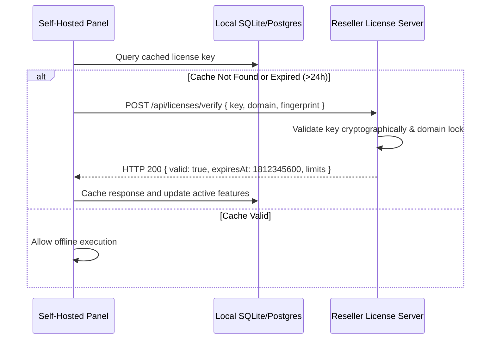

# Licensing & Activation System Architecture

This document outlines the architecture for implementing self-hosted license verification and domain locking in the WhatsApp Panel distribution package.

---

## 1. Licensing Model Overview

For self-hosted distribution, the application uses a phone-home license validation engine. 

- **Domain Locking**: Licenses are restricted to specific domains (e.g. `panel.customer.com`). Subdomain wildcard licenses can optionally be validated.
- **Expiration Enforcement**: Checks license validity intervals. If expired, access to Campaigns, Sockets, and Webhook triggers is suspended.
- **Activation Keys**: Unique cryptographic hashes generated upon checkout containing encrypted metadata (payload: customer ID, plan limits, expiry epoch, domain regex).

---

## 2. Verification Flow



---

## 3. License Verification API Structure

### Verification Request (`POST /api/licenses/verify`)
Dispatched by the self-hosted backend container to the reseller verification server.

```json
{
  "licenseKey": "LIC-XXXX-YYYY-ZZZZ-WWWW",
  "domain": "wadesk.authai.space",
  "machineFingerprint": "8d3e91a0c4f8287ea6b2512f4581a0b3",
  "currentVersion": "1.1.0-white-label",
  "systemTimestamp": "2026-06-09T17:53:03Z"
}
```

### Verification Success Response (`HTTP 200`)
```json
{
  "success": true,
  "license": {
    "licenseKey": "LIC-XXXX-YYYY-ZZZZ-WWWW",
    "domain": "wadesk.authai.space",
    "licensee": "Customer Name",
    "issuedAt": "2026-06-01T00:00:00Z",
    "expiresAt": "2027-06-01T00:00:00Z",
    "status": "ACTIVE"
  },
  "signature": "MEQCIFz9K3dYJ5V8t62...[Cryptographic signature verifying payloads]"
}
```

### Verification Failure Response (`HTTP 403 / 400`)
```json
{
  "success": false,
  "error": "DOMAIN_MISMATCH",
  "message": "This license key is locked to wadesk.authai.space, but request originated from another domain."
}
```

---

## 4. Local Activation Fallback

For air-gapped or offline environments:
1. Provide customers with an offline **activation file** (`license.key` containing asymmetric RSA-signed JSON).
2. The self-hosted backend reads the file, parses it, and uses the reseller's public key (hardcoded in the app environment) to decrypt and verify the signature locally, completely bypassing the phone-home requirement.
